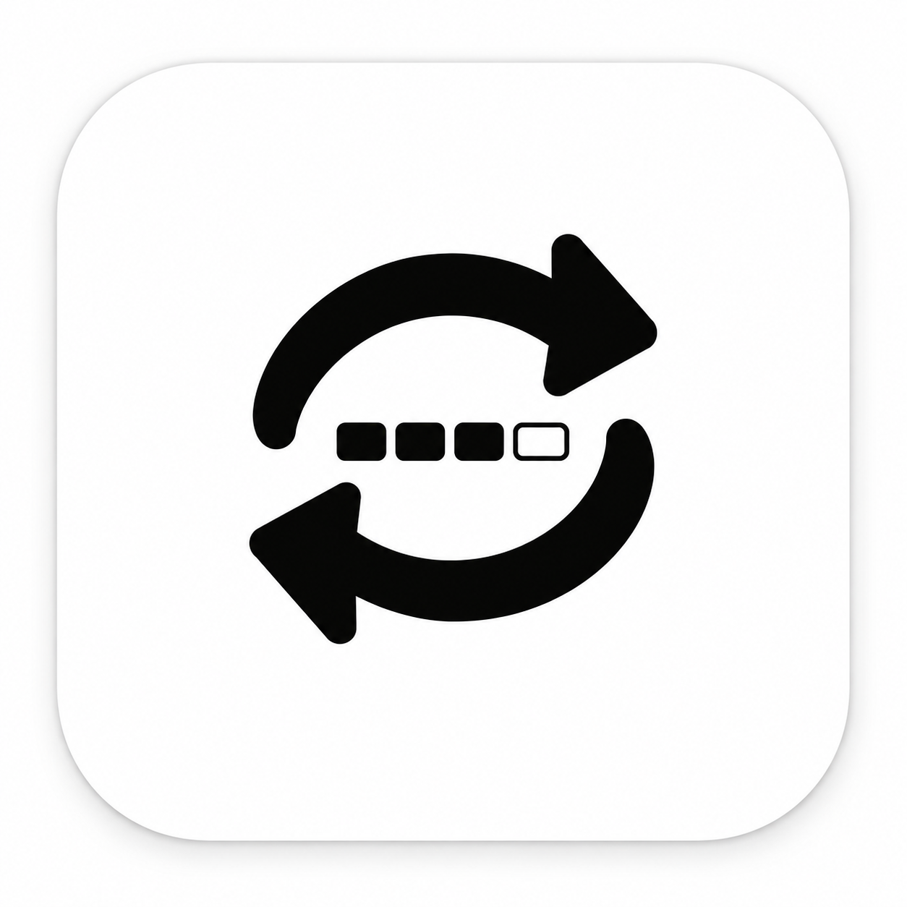

# Codex Accounts



A little Mac app for people with more than one Codex account. See how much quota you have left and switch accounts without signing out and back in each time.

[简体中文](README.zh-CN.md) · [Download](https://github.com/braklouis/codex-account-switcher/releases/latest)

## What it does

- Keeps your accounts together, with the active account at the top.
- Shows time until reset above your remaining quota in the menu bar.
- Lets you choose percentages, a progress bar, or both.
- Reminds you when quota drops below 75%, 50%, and 25%.
- Supports English and Chinese, launch at login, and hiding the Dock icon.

Accounts are saved in your Mac's Keychain. There is no account upload service or telemetry.

## Install

Requires **macOS 14+, Apple Silicon, and the official Codex desktop app**.

```sh
brew trust --cask braklouis/tap/codex-accounts
brew tap braklouis/tap
brew install --cask braklouis/tap/codex-accounts
```

If your Homebrew version doesn't have `brew trust`, skip the first line. You can also download the app from [Releases](https://github.com/braklouis/codex-account-switcher/releases/latest) and drag it into Applications.

### First time opening it?

The app isn't Apple-notarized yet. If macOS says Apple cannot verify it, and you trust this download:

1. Try opening the app, then dismiss the warning without moving it to Trash.
2. Go to **System Settings → Privacy & Security → Open Anyway**.
3. Confirm **Open** when prompted.

You don't need to disable Gatekeeper. This applies to the verification warning, not a warning that malware was detected. [More details from Apple](https://support.apple.com/en-us/102445).

## Getting started

Open the app and choose **Save current account**, or **Add account** to sign in through your browser. Allow Keychain access when asked, then refresh your quota.

Click an account to switch. Finish any running Codex tasks and CLI sessions first: switching restarts Codex. Your accounts share local task history and projects.

Language, menu bar appearance, startup, and notifications are in **Settings**. The app checks quota every five minutes.

Currently supports subscription accounts using Codex's default home and file-based sign-in. API keys and custom credential stores aren't supported. This is an independent project, not an official OpenAI app.

## Build from source

With Apple's developer tools installed:

```sh
git clone https://github.com/braklouis/codex-account-switcher.git
cd codex-account-switcher
swift test --disable-sandbox
zsh scripts/package.sh
open 'dist/Codex Accounts.app'
```

Add `--args --demo` to the last command to try it with sample accounts.

## About

Inspired by [CodexBar](https://github.com/steipete/CodexBar). Built with SwiftUI and AppKit; the icon is AI-generated.

[MIT license](LICENSE) · [Security & privacy](SECURITY.md) · [Contributing](CONTRIBUTING.md)
